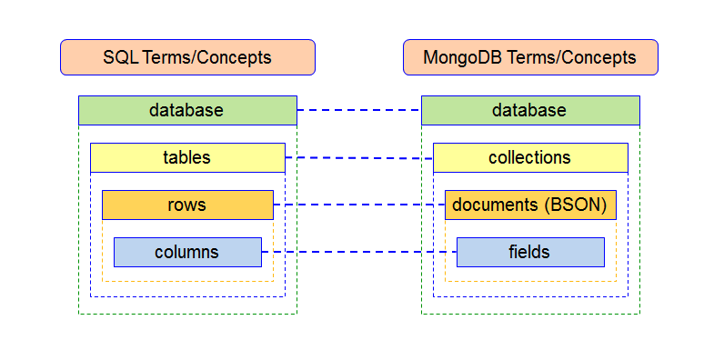

# diferencias de bd sql



[instalar-mongoDB](https://www.youtube.com/watch?v=cHGaDfzJyY4)

`porque esta bueno aprender js en el backend?`
ahora podemos utilizar la syntaxis de ES6 que hace todo mucho mas familiar y simple ( si conoces front end)

proyecto CREATE\_

- npm init -y
- yarn add express mongoose body-parser
- editar package.json con
  - "type":"module" // permite usar import _ from _;
  - "start":"nodemon server.js" // evitar el reinicio manual de la aplicacion

`estrctura`

- /src
  - /routes
  - /controllers
  - /models
    `

# como agregarse al proyecto.

<pre>
npm i mongoose
</pre>

- base database.js

```
import mongoose from 'mongoose';
const uri = "mongodb://localhost:27017/test";
const db = mongoose;


db.connect(uri,{useUnifiedTopology:true,useNewUrlParser:true});

db.connection.once('open', err=>{
  console.log('funciona')
});
db.connection.once('error', err=>{
  console.log('fallo')
});


export default db;


```

- modelo/schema Product.js

```

import mongoose from 'mongoose';
const Schema = mongoose.Schema;

const camisetaSchema = new Schema({
    color : String ,
    imagen:String
});

export default mongoose.model('camisetaSchema',camisetaSchema)
```

- usando modelo y conexion

```

import database from './config/database.js';
import camisetaSchema from './model/camisetaSchema.js';


const nuevoejemplaqr  = camisetaSchema({
    color:"zz",
    imagen:"zzz",
})
nuevoejemplaqr.save(); // guardado en async
```
